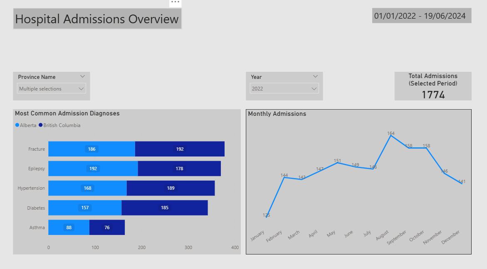

# 🏥 Hospital Admissions Analysis (SQL + Power BI)

## 📌 Project Overview
This project analyzes hospital admission data to uncover trends in patient admissions, diagnoses, and regional distributions.  
The objective is to demonstrate **SQL-driven data analysis** combined with **clear, business-focused visualizations** in Power BI.

All analytical logic is implemented in **PostgreSQL**, while Power BI is used strictly for visualization and exploration.

---

## 🧰 Tech Stack
- **Database:** PostgreSQL  
- **SQL:** JOINs, CTEs, CASE statements, window functions (`LAG`)  
- **Visualization:** Power BI  
- **Version Control:** Git & GitHub  

---

## 🗂 Database Schema
The database consists of four normalized tables:

- `patients` — patient demographics and physical attributes  
- `doctors` — doctor details and specialties  
- `admissions` — hospital admission events (fact table)  
- `provinces` — geographic dimension  

Foreign keys are used to enforce **referential integrity** between tables.

---

## 📊 Key Business Questions Answered

### 1. How do hospital admissions change over time?
- Daily and monthly admission trends
- Identification of peaks and declines in admission volume

### 2. What are the most common admission diagnoses?
- Ranking diagnoses by total number of admissions
- Comparing diagnosis frequency across selected provinces

### 3. How do admissions vary by province?
- Patient distribution by province
- Identification of provinces with gender imbalances

### 4. What is the total admission volume for a selected period?
- KPI showing total admissions filtered by year and province

---

## 🧠 SQL-First Approach
All analytical logic is written in SQL and stored in the `/sql` directory.

Examples include:
- Aggregations for daily and monthly trends
- Day-over-day changes using window functions
- Conditional aggregation using `CASE`
- Multi-table joins for demographic and regional analysis

Power BI consumes **query results**, not raw tables, ensuring SQL remains the single source of truth.

---

## 📈 Power BI Dashboard
The Power BI report includes:
- **Monthly Admissions Trend** (line chart)
- **Most Common Admission Diagnoses** (bar chart)
- **Total Admissions KPI**
- Interactive slicers for **Year** and **Province**

The dashboard design prioritizes clarity, readability, and executive-level communication.

---

## 📂 Repository Structure

hospital-sql-analysis/
├── sql/
│ ├── 01_daily_admissions.sql
│ ├── 02_daily_admission_change.sql
│ ├── 03_admissions_by_diagnosis.sql
│ ├── 04_admission_cost_by_insurance.sql
│ ├── 05_obesity_analysis.sql
│ ├── 06_patients_by_province.sql
│ ├── 07_gender_by_province.sql
│ └── 08_provinces_more_males_than_females.sql
├── schema.sql
├── insert_data.sql
├── powerbi/
│ └── hospital_analysis.pbix
└── README.md

---

## 🚀 Key Takeaways
- Strong SQL fundamentals applied to a realistic dataset
- Clear separation between data logic (SQL) and presentation (Power BI)
- Focus on answering real business questions, not just writing queries
- Clean and professional dashboard design with restrained use of visuals

---

## 📬 Notes
This project uses **synthetic data** generated for learning and demonstration purposes.

---

### 🧠 Interview One-Liner
> “This project demonstrates how I use SQL to answer business questions and Power BI to communicate insights clearly.”

## 📸 Dashboard Preview

